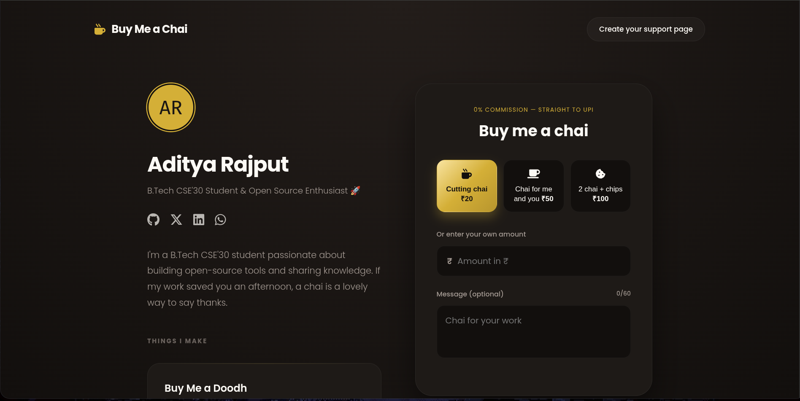
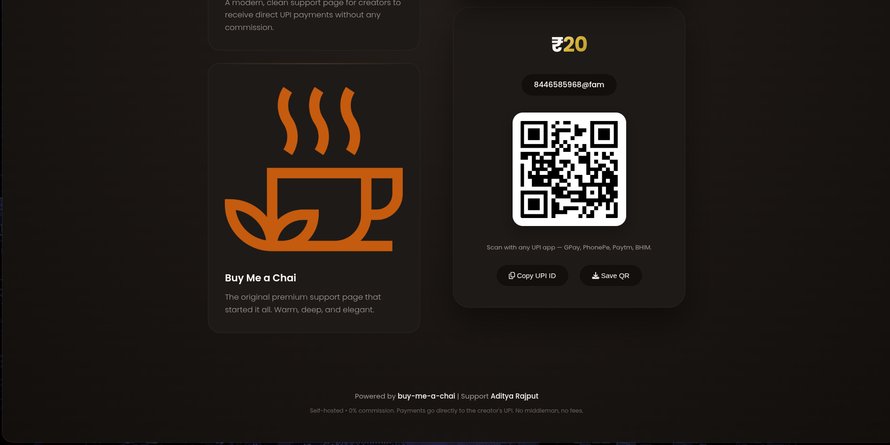
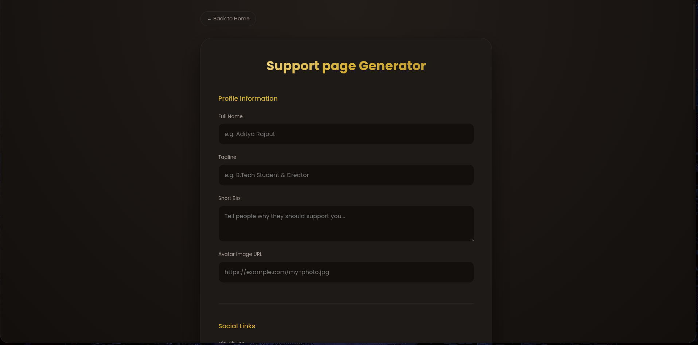
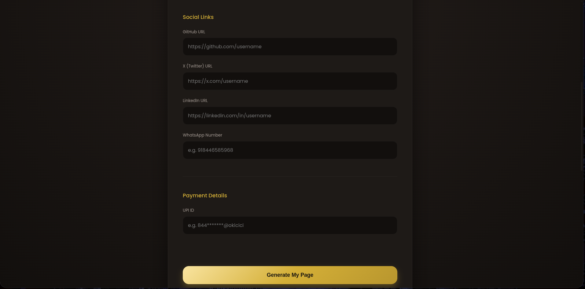
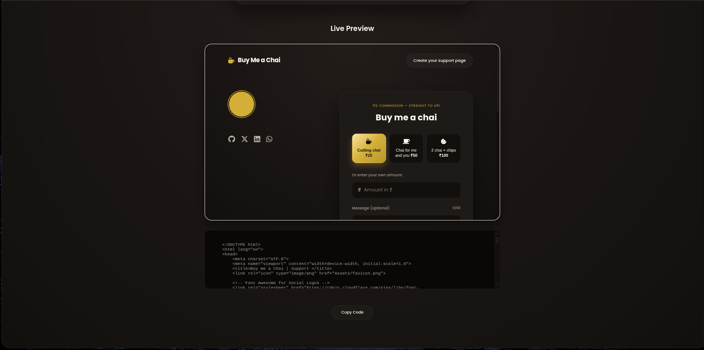

# ☕ Buy Me a Chai

**A premium, zero-commission support page generator for creators.**

Buy Me a Chai allows developers, designers, and creators to set setup a stunning, high-end support page in seconds. Unlike other platforms, there are no middlemen and no fees—payments go directly from the supporter to the creator's UPI ID.

---

## 🌟 Features

- **✨ Premium Aesthetic**: A deep, warm, gold-accented theme designed for a professional look.
- **⚡ Instant Generation**: Real-time live preview of your page as you enter your details.
- **💰 0% Commission**: Direct UPI integration. No platform fees, no waiting periods.
- **📦 Portable Code**: Generates a single, self-contained HTML file including all CSS and JS.
- **📱 Fully Responsive**: Looks beautiful on desktops, tablets, and mobile phones.
- **🛠️ One-Click Copy**: Quickly copy your generated code and deploy it anywhere.

---

## 📸 Preview

### Main Support Page
<p align="center">
  
  
</p>

### Support Page Generator
<p align="center">
  
  
  
</p>

---

## 🚀 How to Create Your Own Page

You don't need to be a coder to use this tool! Just follow these simple steps:

1. **Visit the Generator**: Open the `make.html` page.
2. **Enter Your Details**: Fill in your name, a catchy tagline, your bio, and your social media links.
3. **Set Your Payment**: Enter your UPI ID. The tool automatically generates your payment QR code.
4. **Customize**: Watch your page come to life in the **Live Preview** window.
5. **Deploy**: Click **"Generate My Page"**, copy the resulting code, and save it as `index.html` in a new GitHub repository.
6. **Go Live**: Enable **GitHub Pages** in your repository settings, and your support page is live for the world!

---

## 🛠️ Technical Setup (For Developers)

If you want to run this project locally or contribute to it, follow these steps:

### Prerequisites
No installation is required! This is a static project.

### Local Execution
1. Clone the repository:
   ```bash
   git clone https://github.com/Aditya0058/Buy-Me-A-Chai.git
   ```
2, Navigate to the project folder:
   ```bash
   cd Buy-Me-A-Chai
   ```
3. Open `index.html` or `make.html` in any modern web browser.

### Architecture
- **Frontend**: HTML5, CSS3 (Custom Properties/Variables), and Vanilla JavaScript.
- **Templating**: Uses a custom string-replacement engine in `generator.js` to inject user data into a portable HTML template.
- **Styling**: Implements a "Rich Theme" using radial gradients and gold-accented highlights for a premium feel.

---

## 🌐 Deployment Guide

To host your generated page for free using GitHub Pages:

1. Create a new repository on GitHub.
2. Upload the generated `index.html` file.
3. Go to **Settings** $\rightarrow$ **Pages**.
4. Under **Build and deployment**, set the source to **Deploy from a branch** and select `main`.
5. Save and wait a few seconds. Your site will be live at `https://yourusername.github.io/your-repo-name/`.

---

## 🤝 Credits & License

Created with ❤️ by **Aditya Rajput**.

This project is open-source. Feel free to fork it, improve it, and build your own support system!
